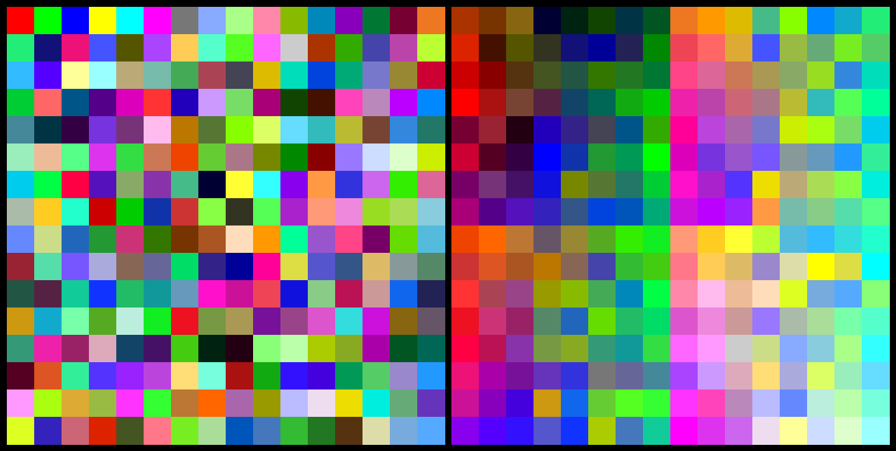
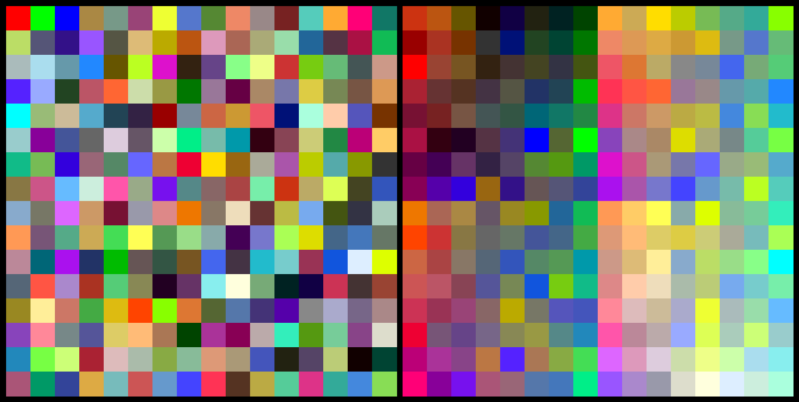

This is an experimental package to generate color palettes. We train a neural network to generate a color space that's _perceptually uniform_. Older classic methods do not have this property.

RGB (most simple method)

Euclidean distance in CIELAB color space:

CIE94 color difference formula:

CIEDE2000 color difference formula:

Our method (neural network based):

